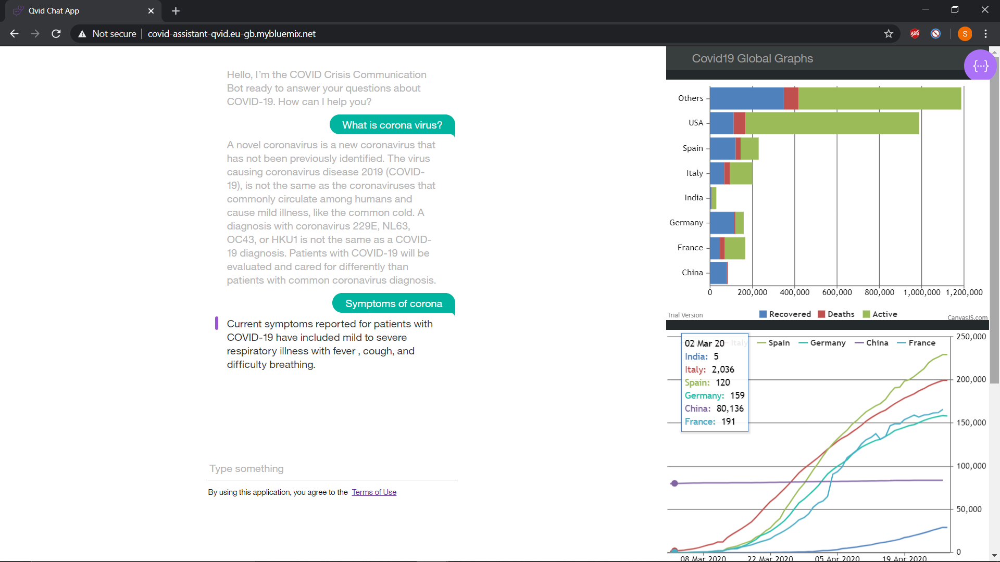

# COVID Crisis Communications Starter Kit

This solution starter was created by technologists from IBM.  Translations are available: [JP](/README_JP.md)

## Authors

- Debanjan Chakraborty - Cognizant
- Reema Pathak - Cognizant
- Jyoti Mohapatra - Cognizant
- Suraj Jeswara - Cognizant
- Koushik Das - Cognizant
- Koustuv Das - Cognizant
- Puja Rani - Cognizant
- Siddhartha Sen - Cognizant

## Contents

1. [Overview](#overview)
2. [Video](#video)
3. [The idea](#the-idea)
4. [How it works](#how-it-works)
5. [Diagrams](#diagrams)
6. [Documents](#documents)
7. [Datasets](#datasets)
8. [Technology](#technology)
9. [Getting started](#getting-started)
10.[Resources](#resources)
11.[License](#license)

## Overview

### What's the problem?
In times of crisis, communications systems are often overwhelmed with people trying to find basic information about testing, symptoms, community response, and other resources. When communication lines get clogged, people who need real help can't get through. Chatbots help respond to tens, even hundreds, of thousands of messages a day.

### How can technology help ?

Whether via text, phone, websites, or communication apps, conversing with chatbots and other AI-enabled resources can play a critical role in helping communities quickly understand crucial information and free up customer service resources to focus on higher-level issues.

IBM Watson Assistant service helps you build, train, and deploy conversational interactions into any application, device, or channel. Creating a chatbot using Watson Assistant can help address the issues that our users face while trying to gather accurate, relevant information. Whether you're trying to learn the latest news about Covid-19 or learn where there's testing in your area, a chatbot can play a major role in helping communities quickly understand crucial information and free up customer service resources to focus on higher-level issues.

## Demo video

[](https://www.youtube.com/watch?v=o5bPZUVUVH0)


## The idea

COVID-19 has citizens looking for answers about symptoms and testing sites as well as current status of schools, transportation, and other public services. Using Watson Assistant, this Call for Code Starter Kit has designed a virtual assistant pre-loaded to understand and respond to common questions about COVID-19, scan COVID-19 news articles using Watson Discovery and respond to COVID statistics inquires with data from trusted sources.

With this Watson Assistant powered Crisis Communications Starter Kit you can integrate a chatbot into your Call for Code solution in an IBM Cloud hosted web server, using a Slack integration or via a Node-RED Dashboard. 

It can:
- Respond by sharing consistent, accurate COVID-19 information
- Help citizens quickly and easily access the latest information through their channel of choice – voice, text or collaborative tool
- Free valuable resources by automating answers to common COVID-19 questions
- Dynamically update information with the latest developments and recommendations

The challenge for you is to build out from this framework to create a more complete solution.

## How it works


## Diagrams

### Website integration with COVID-19 crisis communication chatbot


1. User visits a website with the COVID-19 chatbot and asks a question.
2. Node.js web server calls the Watson Assistant service hosted in IBM Cloud.
3. Watson Assistant uses natural language understanding and machine learning to extract entities and intents of the user question.
4. Source COVID-19 FAQ information from trusted CDC data.
5. Watson Assistant invokes an OpenWhisk open source powered IBM Cloud Function.
6. IBM Cloud Function calls the Watson Discovery service running in IBM Cloud.
7. Watson Discovery scans news articles and responds with relevant articles.
8. Watson Assistant invokes an OpenWhisk open source powered IBM Cloud Function.
9. IBM Cloud Function calls the COVID-19 API to get statistics.
10. Watson Assistant replies to the user inquiry.
11. Node.js web server displays the chat answer to the user.


## Documents

### Trusted sources for COVID-19 information
- [CDC COVID-19 FAQ](https://www.cdc.gov/coronavirus/2019-ncov/faq.html)

### Tutorials and documentation:

- [How-to guides for chatbots](https://www.ibm.com/watson/how-to-build-a-chatbot)
- [Learning path: Getting started with Watson Assistant](https://developer.ibm.com/series/learning-path-watson-assistant/)
- [Chatbot with Watson Discovery](https://github.com/IBM/watson-discovery-sdu-with-assistant)
- [Chat Bot Slack Deployment](https://cloud.ibm.com/docs/assistant?topic=assistant-deploy-slack)
- [Node-RED Slack Integration](https://www.ibm.com/cloud/blog/create-a-chatbot-on-ibm-cloud-and-integrate-with-slack-part-1)
- [Train a speech-to-text model](https://developer.ibm.com/patterns/customize-and-continuously-train-your-own-watson-speech-service/)
- [Making Programmatic Calls from Watson Assistant](https://cloud.ibm.com/docs/assistant?topic=assistant-dialog-webhooks)
- [IBM Cloud Voice Agent with Twilio](https://developer.ibm.com/recipes/tutorials/ibms-voice-agent-with-watson-and-twilio/)
- [Watson Assistant](https://cloud.ibm.com/docs/assistant?topic=assistant-getting-started)

## Datasets

- [covid19api](https://covid19api.com/)

## Technology

### IBM technology

- [IBM Watson Assistant](https://www.ibm.com/cloud/watson-assistant/)
- [Watson Discovery](https://www.ibm.com/cloud/watson-discovery)
- [Watson Speech to Text](https://www.ibm.com/cloud/watson-speech-to-text)
- [Watson Text to Speech](https://www.ibm.com/cloud/watson-text-to-speech)
- [IBM Cloud Functions](https://cloud.ibm.com/functions/)

### Open source technology

- [Node.js](https://nodejs.org/en/)
- [Apache OpenWhisk](https://openwhisk.apache.org/)
- [Node-RED](https://nodered.org/)

## Getting started

### Prerequisite

- Register for an [IBM Cloud](https://www.ibm.com/account/reg/us-en/signup?formid=urx-42793&eventid=cfc-2020?cm_mmc=OSocial_Blog-_-Audience+Developer_Developer+Conversation-_-WW_WW-_-cfc-2020-ghub-starterkit-communication_ov75914&cm_mmca1=000039JL&cm_mmca2=10008917) account.

### Set up an instance of Watson Assistant

Log in to IBM Cloud and provision a Watson Assistant instance.

**Step 1.** From the [IBM Cloud catalog](https://cloud.ibm.com/catalog/services/watson-assistant), provision an an instance of **Watson Assistant**.
  

**Step 2.**  Launch the Watson Assistant service.

**Step 3.** Click **Create assistant** and follow [these detailed instructions](https://cloud.ibm.com/docs/assistant?topic=assistant-assistant-add) for how to create an assistant.
  

**Step 4.** Name the Watson Assistant instance **COVID Crisis Communication**
  

**Step 5.** Click **Add Dialog skill** to add this to your assistant. Follow [the documentation](https://cloud.ibm.com/docs/assistant?topic=assistant-skill-dialog-add) if you have questions.
  

**Step 6.** Click **Import skill > Choose JSON file** and import the [`skill-CDC-COVID-FAQ.json`](./starter-kit/assistant/skill-CDC-COVID-FAQ.json) file.
  

**Step 7.** Go back to the All Assistants page. From the action menu ( **`⋮`** ), open **Settings**.
  

**Step 8.**  On the Settings tab, click **API Details** on the left and make a note of the `Assistant ID` and `Api Key` for future use.
  

**Step 9.** Go back to the All Assistants page and click on the **Skills** link.
  

**Step 10.** On the Skill page, click on the action menu ( **`⋮`** ), open **View API Details**.
  

**Step 11.** On the Skill Details page, make note of the `Skill ID` for future use.
  

**Step 12.**  Go back to your dialog skill and click on the **Preview Link** button on the side to get a link to test and verify your assistant.
  

**Step 13.** Ask the Watson Assistant chatbot some questions about COVID-19.
<p align="center">

</p>


### Connect your chatbot to data sources via a webhook

Now that you’ve created your Watson Assistant-enabled chatbot, you need to connect it to a data source. With Watson Assistant, you need to do this via a webhook.

A webhook is a mechanism that allows you to call out to an external program based on something happening in your program. When used in a dialog skill, a webhook is triggered when the assistant processes a node that has a webhook enabled. The webhook collects data that you specify or that you collect from the user during the conversation and save in context variables. It sends the data as part of a HTTP POST request to the URL that you specify as part of your webhook definition. The URL that receives the webhook is the listener. It performs a predefined action using the information that you pass to it as specified in the webhook definition, and can optionally return a response.

# Adding Webhooks to Watson Assistant

You can query for dynamic data using webhooks in IBM Watson Assistant. Our crisis communication chatbot uses two different sources:

- [Watson Discovery](https://www.ibm.com/cloud/watson-discovery)
- [COVID-19 API](https://covid19api.com/)
- [Weather Company Data](https://weather.com/coronavirus)

## Prerequisites
- Create an [IBM Cloud Account](https://www.ibm.com/account/reg/us-en/signup?formid=urx-42793&eventid=cfc-2020?cm_mmc=OSocial_Blog-_-Audience+Developer_Developer+Conversation-_-WW_WW-_-cfc-2020-ghub-starterkit-communication_ov75914&cm_mmca1=000039JL&cm_mmca2=10008917).
- Create a Watson Assistant COVID-19 crisis communications chatbot. [Follow these instructions](/README.md#getting-started)
- Create a [Weather Company API Account](https://callforcode.weather.com/register/)

### Make use of Discovery to get news information

1. From your IBM Cloud account, go to Watson Discovery.


2. Create a new lite service.


3. Make note of the API key and the URL. You need that in the next steps.


4. Open the Watson Discovery NEWS service, which is a prepopulated discovery dataset updated and maintained by the Watson Discovery team. 


5. From the top right corner, open the API tab. Make note of the Collection ID and Environment ID.


### Get a Weather Company API Key

1. Go to [https://callforcode.weather.com/register/](https://callforcode.weather.com/register/)

2. Signup with your info. Your API key will be emailed to you.

3. Save the API key for future use.

### Creating Cloud Functions

1. In the IBM Cloud catalog, go to [IBM Cloud Functions](https://cloud.ibm.com/functions/).

2. Click **Start Creating**.


3. Select **Create Action**.


4. Name your action. For the Runtime dropdown, select **Node.js 10**.


5. Replace the code with [action/covid-webhook.js](./action/covid-webhook.js)


6. Our code has two main parts. We decide whether to call the COVID-19 API or Watson Discovery based on a parameter sent on the function call. If a query param of `type=api` is set, you call the COVID-19 API on the [summary endpoint](https://api.covid19api.com/summary). 

It returns the data in the following format:

```
{
  Countries: [
    {
      Country: "",
      Slug: "",
      NewConfirmed: 0,
      TotalConfirmed: 0,
      NewDeaths: 0,
      TotalDeaths: 0,
      NewRecovered: 0,
      TotalRecovered: 0
    },
    {
      Country: " Azerbaijan",
      Slug: "-azerbaijan",
      NewConfirmed: 0,
      TotalConfirmed: 0,
      NewDeaths: 0,
      TotalDeaths: 0,
      NewRecovered: 0,
      TotalRecovered: 0
    },
    ...
  ]
}
```

7. If there is specific location (Country/Country Code/US State) selected, you look for that location either using The Weather Company API or in the summary response and return the status for that location.

For example, the response for `type=api` and `location=United States of America` is shown below.

```
{
  "result": "Total Cases: 65778\nTotal Deaths: 942\nTotal Recovered: 361\n\nSource: Johns Hopkins CSSE"
}
```

8. If you want to make a call to the Discovery service, you need to set some parameters that let you call the IAM-enabled service. On the left, click on the **Parameters** tab. Add the following parameters: 
    - `api_key` (Discovery API Key)
    - `twcApiKey` (API key from The Weather Company)
    - `url` (Discovery Service URL)
    - `collection_id`
    - `env_id`


9. Enable the action as a web action. To do so, select the **Endpoints** tab on the left. Click the checkbox beside "Enable as Web Action."


10. Make note of the HTTP URL. You will use this as the webhook for your assistant. You will have to add `.json` in the end of this url to make it work as a webhook.


### Integrate data sources via a Watson Assistant webhook

- For detailed instructions on how to do this, check out our documentation: [Making Programmatic Calls from Watson Assistant](https://cloud.ibm.com/docs/assistant?topic=assistant-dialog-webhooks).

1. Bring up the COVID-19 assistant you created earlier. Find it in your IBM Cloud account under services > IBM Watson Assistant. Open the dialog by clicking the `CDC COVID FAQ` Dialog.


2. Click on **Options** on the left.


3. Under Options > Webhooks, in the URL text box, paste the URL from the Cloud Funciton step. Make sure to add a `.json` at the end of the URL.


4. Select **Dialog** on the left navigation.


5. Open up any dialog node you want to add a webhook call for. 

6. After selecting the node, click **Customize**.


7. Enable Webhooks by moving the toggle button to **On** in the Webhooks section. Click **Save**.


8. Add any parameter your webhook needs. These will be sent as query parameters.


9. Test that your webhook integration is working by going to the Try It tab and initiating a dialog that calls the webhook.


You can easily use webhooks to give your Watson Assistant access to many external APIs and databases.


### Embed your COVID-19 chatbot on a Node.js website

Finally, you can embed your COVID-19 crisis communication chatbot on a Node.js website.

This tutorial takes you through building a simple Node.js application that is connected to a COVID-19 chatbot using the Watson Assistant APIs. The steps are taken from this [assistant-simple repository](https://github.com/watson-developer-cloud/assistant-simple) and adopted for 2020 Call for Code challenge. You can use this tutorial as a starting template for the [COVID-19 challenge](https://developer.ibm.com/callforcode/getstarted/covid-19/).

## Learning objectives

In this tutorial, you will:

1. Learn how to create a simple Node.js application.
2. Connect the application to a chatbot using the IBM Watson Assistant APIs.
3. Test and run the application locally.
4. Deploy the application on IBM Cloud as a Cloud Foundry application.

Here is a demo of the final application:



## Prerequisites

1. Sign up for an [IBM Cloud account](https://www.ibm.com/account/reg/us-en/signup?formid=urx-42793&eventid=cfc-2020?cm_mmc=OSocial_Blog-_-Audience+Developer_Developer+Conversation-_-WW_WW-_-cfc-2020-ghub-starterkit-communication_ov75914&cm_mmca1=000039JL&cm_mmca2=10008917).
1. Download the [IBM Cloud CLI](https://cloud.ibm.com/docs/cli/index.html#overview). You will use it to push your Node.js application to the cloud.
1. You should already have a Watson Assistant service created when you deployed the COVID bot. You need to get the credentials from that chatbot to use in your Node.js application:
    - Log in to your IBM Cloud account.
    - Go to resources and open your Watson Assistant service instance.
    - You will be taken to Watson Assistant launch page. Click **Service Credentials** to view the service credentials.
      
    - You will use these credentials to populate the `.env` file when configuring the application below. Copy and save the JSON somewhere or leave this window open.

## Estimated **time**

This tutorial will take you about 30 minutes to complete.

## Steps

The following steps assume that you have created an assistant, imported the COVID skills, and have the Watson Assistant service credentials available.

## Configuring the application

1. Clone the repository and cd into `Covid19ChatBot-master`.

2. Copy the *.env.example* file to a file called *.env*

    ```
    cp .env.example .env
    ```

3. Open the *.env* file and add the service credentials that you obtained in the previous step. 

    The following example *.env* file configures the `apikey` and `url` for a Watson Assistant service instance hosted in the US East region:

    ```
    ASSISTANT_IAM_APIKEY=X4rbi8vwZmKpXfowaS3GAsA7vdy17Qhxxxxxxxx
    ASSISTANT_URL=https://gateway-wdc.watsonplatform.net/assistant/api
    ```

    - If your service instance uses `username` and `password` credentials, add the `ASSISTANT_USERNAME` and `ASSISTANT_PASSWORD` variables to the *.env* file.

    The following example *.env* file configures the `username`, `password`, and `url` for a Watson Assistant service instance hosted in the US South region:

    ```
    ASSISTANT_USERNAME=522be-7b41-ab44-dec3-xxxxxxxx
    ASSISTANT_PASSWORD=A4Z5BdGENxxxx
    ASSISTANT_URL=https://gateway.watsonplatform.net/assistant/api
    ```
    
    However, if your credentials contain an IAM API key, copy the `apikey` and `url` to the relevant fields.
    
    ```JSON
      {
        "apikey": "ca2905e6-7b5d-4408-9192-xxxxxxxx",
        "iam_apikey_description": "Auto generated apikey during resource-key ...",
        "iam_apikey_name": "auto-generated-apikey-62b71334-3ae3-4609-xxxxxxxx",
        "iam_role_crn": "crn:v1:bluemix:public:iam::::serviceRole:Manager",
        "iam_serviceid_crn": "crn:v1:bluemix:public:iam...",
        "url": "https://gateway-syd.watsonplatform.net/assistant/api"
      }
    ```
   
   ```
    ASSISTANT_IAM_APIKEY=ca2905e6-7b5d-4408-9192-xxxxxxxx
    ```

4. Add the `ASSISTANT_ID` to the previous properties:

    ```
    ASSISTANT_ID=522be-7b41-ab44-dec3-xxxxxxxx
    ```

## Running locally

1. Install the dependencies:

    ```
    npm install
    ```

1. Run the application:

    ```
    npm start
    ```

1. View the application in a browser at `localhost:3000`.

## Deploy to IBM Cloud as a Cloud Foundry application

1. Log in to IBM Cloud with the [IBM Cloud CLI](https://cloud.ibm.com/docs/cli/index.html#overview):

    ```
    ibmcloud login
    ```

1. Target a Cloud Foundry organization and space:

    ```
    ibmcloud target --cf
    ```

1. Edit the *manifest.yml* file. Change the **name** field to something unique.  
  For example, `- name: covid-assistant-simple-yourname`.

1. Deploy the application

    ```
    ibmcloud app push
    ```

1. View the application online at the app URL. For example, [covid-assistant-simple-yourname.mybluemix.net](covid-assistant-simple-yourname.mybluemix.net).

## Take on COVID-19

You now know how to build a chatbot using Watson Assistant and a website on IBM Cloud that users to interact with the chatbot. You can see some other Watson Assistant sample applications in the [official documentation](https://cloud.ibm.com/docs/services/assistant?topic=assistant-sample-apps). 

It's your turn to use these technologies to help tackle this pandemic and make a difference by accepting the [COVID-19 challenge](https://developer.ibm.com/callforcode/getstarted/covid-19/)!


## Disclosures

This tool is intended to provide information based on currently available CDC and other public information to help you make decisions about seeking appropriate medical care. This system is not intended for the diagnosis or treatment of disease or other conditions, including COVID-19, and you should not provide any personally identifying or private health information.

This Watson Assistant bot is populated with data that is sourced from the following resources:

- Most static responses provide information found on the CDC's COVID FAQ Page: https://www.cdc.gov/coronavirus/2019-ncov/faq.html
- Dynamic infection and death counts are sourced from Johns Hopkins University via the following API: https://www.covid19api.com/
- Dynamic news stories are sourced from Watson Discovery's news feed. Additional information on that service can be found here: https://www.ibm.com/watson/services/discovery-news/

## License

This solution starter is made available under the [Apache 2 License](LICENSE).
