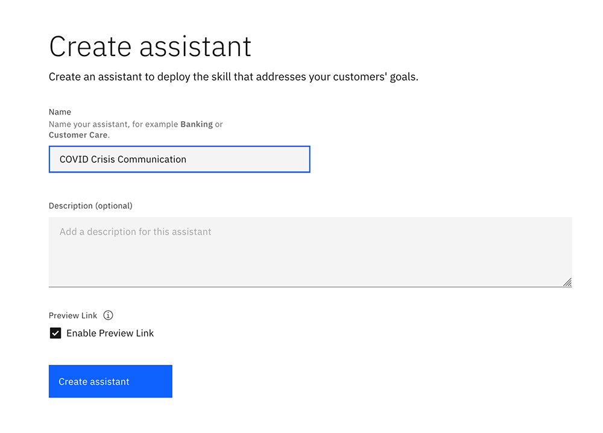
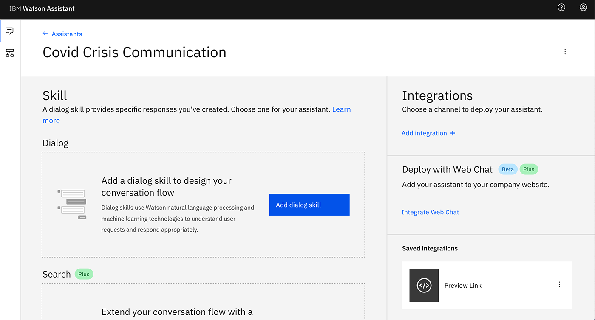
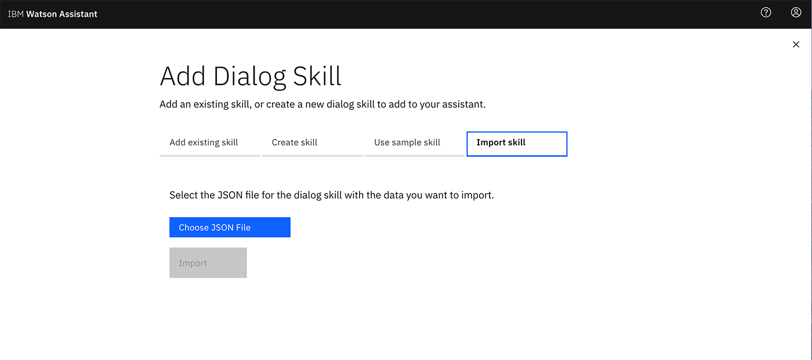
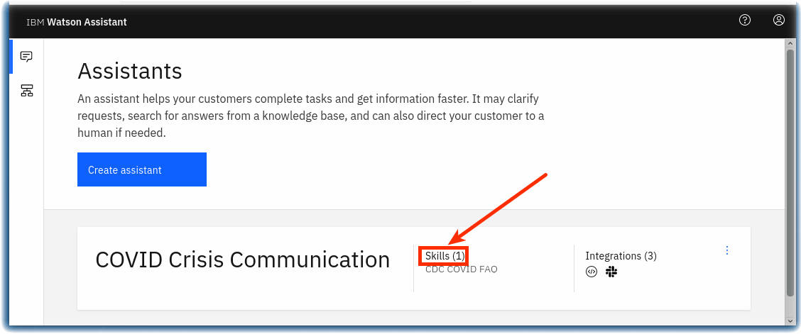

# Qvid, Covid19 Crisis Communication Chat Bot

This solution is created by technologists from Cognizant.  

## Authors

- Debanjan Chakraborty - Cognizant
- Reema Pathak - Cognizant
- Jyoti Mohapatra - Cognizant
- Suraj Jeswara - Cognizant
- Koushik Das - Cognizant
- Koustuv Das - Cognizant
- Puja Rani - Cognizant
- Siddhartha Sen - Cognizant

## Contents

1. [Overview](#overview)
2. [Video](#video)
3. [The idea](#the-idea)
4. [How it works](#how-it-works)
5. [Diagrams](#diagrams)
6. [Documents](#documents)
7. [Datasets](#datasets)
8. [Technology](#technology)
9. [Getting started](#getting-started)
10.[Resources](#resources)
11.[License](#license)

## Overview

### What's the problem?
In times of crisis, communications systems are often overwhelmed with people trying to find basic information about testing, symptoms, community response, and other resources. When communication lines get clogged, people who need real help can't get through. Chatbots help respond to tens, even hundreds, of thousands of messages a day.

### How can technology help ?

Whether via text, phone, websites, or communication apps, conversing with chatbots and other AI-enabled resources can play a critical role in helping communities quickly understand crucial information and free up customer service resources to focus on higher-level issues.

IBM Watson Assistant service helps you build, train, and deploy conversational interactions into any application, device, or channel. Creating a chatbot using Watson Assistant can help address the issues that our users face while trying to gather accurate, relevant information. Whether you're trying to learn the latest news about Covid-19 or learn where there's testing in your area, a chatbot can play a major role in helping communities quickly understand crucial information and free up customer service resources to focus on higher-level issues.

## Video

## The idea

COVID-19 has citizens looking for answers about symptoms and testing sites as well as current status of schools, transportation, and other public services. Using Watson Assistant, this Application has been designed to understand and respond to common questions about COVID-19, scan COVID-19 news articles using Watson Discovery and respond to COVID statistics inquires with data from trusted sources.

With this Watson Assistant powered chatbot in IBM Cloud hosted web server. The burden on traditional systems could be relieved.

It can:
- Respond by sharing consistent, accurate COVID-19 information
- Help citizens quickly and easily access the latest information through their channel of choice – voice, text or collaborative tool
- Free valuable resources by automating answers to common COVID-19 questions
- Dynamically update information with the latest developments and recommendations

The challenge for you is to build out from this framework to create a more complete solution.

## How it works

## Diagrams

### Website integration with COVID-19 crisis communication chatbot

1. User visits a website with the COVID-19 chatbot and asks a question.
2. Node.js web server calls the Watson Assistant service hosted in IBM Cloud.
3. Watson Assistant uses natural language understanding and machine learning to extract entities and intents of the user question.
4. Source COVID-19 FAQ information from trusted CDC data.
5. Watson Assistant invokes an OpenWhisk open source powered IBM Cloud Function.
6. IBM Cloud Function calls the Watson Discovery service running in IBM Cloud.
7. Watson Discovery scans news articles and responds with relevant articles.
8. Watson Assistant invokes an OpenWhisk open source powered IBM Cloud Function.
9. IBM Cloud Function calls the COVID-19 API to get statistics.
10. Watson Assistant replies to the user inquiry.
11. Node.js web server displays the chat answer to the user.

## Documents

### Trusted sources for COVID-19 information
- [CDC COVID-19 FAQ](https://www.cdc.gov/coronavirus/2019-ncov/faq.html)

### Tutorials and documentation:

- [How-to guides for chatbots](https://www.ibm.com/watson/how-to-build-a-chatbot)
- [Learning path: Getting started with Watson Assistant](https://developer.ibm.com/series/learning-path-watson-assistant/)
- [Chatbot with Watson Discovery](https://github.com/IBM/watson-discovery-sdu-with-assistant)
- [Making Programmatic Calls from Watson Assistant](https://cloud.ibm.com/docs/assistant?topic=assistant-dialog-webhooks)
- [Watson Assistant](https://cloud.ibm.com/docs/assistant?topic=assistant-getting-started)

## Datasets
- [covid19api](https://covid19api.com/)

## Technology

### IBM technology

- [IBM Watson Assistant](https://www.ibm.com/cloud/watson-assistant/)
- [Watson Discovery](https://www.ibm.com/cloud/watson-discovery)
- [IBM Cloud Functions](https://cloud.ibm.com/functions/)

### Open source technology

- [Node.js](https://nodejs.org/en/)

## Getting started

### Prerequisite

- Register for an [IBM Cloud](https://www.ibm.com/account/reg/us-en/signup?formid=urx-42793&eventid=cfc-2020?cm_mmc=OSocial_Blog-_-Audience+Developer_Developer+Conversation-_-WW_WW-_-cfc-2020-ghub-starterkit-communication_ov75914&cm_mmca1=000039JL&cm_mmca2=10008917) account.

### Getting Started

Log in to IBM Cloud and provision a Watson Assistant instance.

**Step 1.** From the [IBM Cloud catalog](https://cloud.ibm.com/catalog/services/watson-assistant), provision an an instance of **Watson Assistant**.
  

**Step 2.**  Launch the Watson Assistant service.

**Step 3.** Click **Create assistant** and follow [these detailed instructions](https://cloud.ibm.com/docs/assistant?topic=assistant-assistant-add) for how to create an assistant.
  

**Step 4.** Name the Watson Assistant instance **COVID Crisis Communication**
  

**Step 5.** Click **Add Dialog skill** to add this to your assistant. Follow [the documentation](https://cloud.ibm.com/docs/assistant?topic=assistant-skill-dialog-add) if you have questions.
  

**Step 6.** Click **Import skill > Choose JSON file** and import the [`skill-CDC-COVID-FAQ.json`](assistant/skill-CDC-COVID-FAQ.json) file.
  

**Step 7.** Go back to the All Assistants page. From the action menu ( **`⋮`** ), open **Settings**.
  

**Step 8.**  On the Settings tab, click **API Details** on the left and make a note of the `Assistant ID` and `Api Key` for future use.
  

**Step 9.** Go back to the All Assistants page and click on the **Skills** link.
  

**Step 10.** On the Skill page, click on the action menu ( **`⋮`** ), open **View API Details**.
  

**Step 11.** On the Skill Details page, make note of the `Skill ID` for future use.
  

**Step 12.**  Go back to your dialog skill and click on the **Preview Link** button on the side to get a link to test and verify your assistant.
  

**Step 13.** Ask the Watson Assistant chatbot some questions about COVID-19.

### Connect your chatbot to data sources via a webhook

Now that you’ve created your Watson Assistant-enabled chatbot, you need to connect it to a data source. With Watson Assistant, you need to do this via a webhook.

A webhook is a mechanism that allows you to call out to an external program based on something happening in your program. When used in a dialog skill, a webhook is triggered when the assistant processes a node that has a webhook enabled. The webhook collects data that you specify or that you collect from the user during the conversation and save in context variables. It sends the data as part of a HTTP POST request to the URL that you specify as part of your webhook definition. The URL that receives the webhook is the listener. It performs a predefined action using the information that you pass to it as specified in the webhook definition, and can optionally return a response.

[Follow these instructions for setting up webhook](.webhook/README.md) with the Watson Assistant chatbot you just provisioned.

### Embed your COVID-19 chatbot on a Node.js website

Finally, you can embed your COVID-19 crisis communication chatbot on a Node.js website.

- Follow the [COVID-Simple installation instructions](.covid-simple/README.md)

## Disclosures

This tool is intended to provide information based on currently available CDC and other public information to help you make decisions about seeking appropriate medical care. This system is not intended for the diagnosis or treatment of disease or other conditions, including COVID-19, and you should not provide any personally identifying or private health information.

This Watson Assistant bot is populated with data that is sourced from the following resources:

- Most static responses provide information found on the CDC's COVID FAQ Page: https://www.cdc.gov/coronavirus/2019-ncov/faq.html
- Dynamic infection and death counts are sourced from Johns Hopkins University via the following API: https://www.covid19api.com/
- Dynamic news stories are sourced from Watson Discovery's news feed. Additional information on that service can be found here: https://www.ibm.com/watson/services/discovery-news/

## License

This solution starter is made available under the [Apache 2 License](LICENSE).
